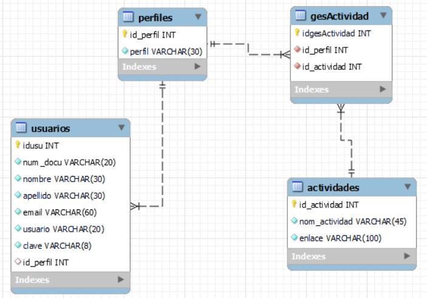
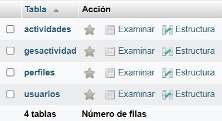
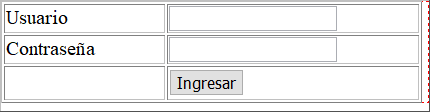
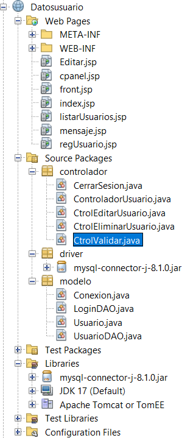

||
||
||

> **LAB.** **PRACTICA** **\#7** **CONTROL.** **DE** **ACCESO**
>
> **TEMAS** **DE** **APRENDIZAJE:** Control de Acceso dinámico.
>
> **ACTIVIDAD** **DE** **ENSEÑANZA** **–** **APRENDIZAJE** **–**
> **EVALUACIÓN:** Implementación de control de acceso, gestión de
> sesiones y visualización dinámica de las actividades de navegación del
> usuario.
>
> **TIEMPO** **DE** **LA** **ACTIVIDAD** **DE** **E-A-E:** 2 horas
>
> **TIEMPO** **DEL** **TALLER** **DE** **APRENDIZAJE:** 2 horas
>
> **OBJETIVOS:**

Construir un prototipo funcional basado en la web que permita controlar
el acceso de los usuarios a la aplicación, así como gestionar y
administrar sus actividades operativas, mediante procesos de validación
y manejo de sesiones del usuario final.

> **ORIENTACIONES:**
>
> • Este laboratorio es la continuación de la práctica \#6
>
> • La actividad se deberá realizar en clase en equipos máximo de dos
> estudiantes
>
> **Conceptos:**
>
> **DashBoard** **o** **Panel** **de** **Control** **(cpanel)** es un
> tablero controlado a través de una interfaz donde el usuario puede
> administrar el equipo, roles, actividades y/o software.
>
> **Menú** en informática, un menú es una serie de opciones que el
> usuario puede elegir para realizar determinadas tareas.
>
> **Menú** **dinámico**, permite la gestión y administración de las
> diferentes opciones desplegadas a través del dashboard y a las puede
> acceder un determinado usuario de acuerdo con el perfil.
>
> Ing. YamilBuenañosPalacios

||
||
||

>  style="width:5.20903in;height:3.63111in" /> style="width:4.76597in;height:2.60875in" />1. Para la construcción del
> control de acceso dinámico, agregar a la base de datos las tablas
> faltantes. Ver figuras 1 y 2.
>
> Fig. 1 – Modelo relacional
>
> Fig. 2- Estructura BD
>
> Ing.YamilBuenañosPalacios, PhD

||
||
||

>  style="width:4.00528in;height:1.11944in" />2. Cree un formulario para
> solicitud de Usuario y Contraseña, guárdelo con el nombre de
> “***indes.jsp***”
>
> Formulario //index.jsp
>
> Fig. 3
>
> **//***Configuración* *formularia*
>
> \<form id="form1" name="form1" method="post" action="ctrolValidar"\>
> \<table width="421" height="102" border="1"\>
>
> \<tr\>
>
> \<td width="157"\>Usuario\</td\>
>
> \<td width="248"\>\<label for="cusuario"\>\</label\>
>
> \<input type="text" name="cusuario" id="cusuario" /\>\</td\> \</tr\>
>
> \<tr\> \<td\>Contraseña\</td\>
>
> \<td\>\<label for="cclave"\>\</label\>
>
> \<input type="password" name="cclave" id="cclave" /\>\</td\> \</tr\>
>
> \<tr\> \<td\>&nbsp;\</td\>
>
> \<td\>\<input name="accion" value="Ingresar" type="submit" id="button"
> /\>\</td\> \</tr\>
>
> \</table\> \</form\>
>
> Ing.YamilBuenañosPalacios, PhD

||
||
||

> 3\. En el paquete Modelo, cree una clase con el nombre “*LoginDAO”,*
> luego configúrelo de acuerdo con el siguiente código.
>
> public class LoginDAO {
>
> Connection conn=null; PreparedStatement stmt =null; ResultSet rs;
>
> public LoginDAO() {
>
> }
>
> public Usuario Login_datos(String usuario, String clave) {
>
> Usuario datos=null;
>
> try { Conexioncn=newConexion(); con = cn.crearConexion();
>
> stmt = (PreparedStatement)conn.prepareStatement("SELECT \* FROM
> usuarios WHERE usuario=? AND clave = ?");
>
> stmt.setString(1,usuario); stmt.setString(2, clave);
>
> rs=stmt.executeQuery();
>
> if(rs.next()) {
>
> datos = new Usuario(); datos.setUsuario(rs.getString("usuario"));
> datos.setClave(rs.getString("clave"));
>
> } rs.close();
>
> stmt.close(); con.close();
>
> } catch (SQLException e) { }
>
> return datos; }
>
> }
>
> Ing.YamilBuenañosPalacios, PhD

||
||
||

> 4\. En el paquete Controlador, cree un Servlet con el nombre
> “*CtrolValidar”,* luego configúrelo de acuerdo con el siguiente código
>
> public class CtrolValidar extends HttpServlet {
>
> LoginDAO logindao = new LoginDAO(); Usuario datos = new Usuario();
>
> protected void processRequest(HttpServletRequest request,
> HttpServletResponse response) throws ServletException, IOException {
>
> response.setContentType("text/html;charset=UTF-8"); }
>
> @Override
>
> protected void doGet(HttpServletRequest request, HttpServletResponse
> response) throws ServletException, IOException {
>
> processRequest(request, response); }
>
> @Override
>
> protected void doPost(HttpServletRequest request, HttpServletResponse
> response) throws ServletException, IOException {
>
> HttpSession ses = request.getSession(true);
> Stringaccion=request.getParameter("accion");
>
> if(accion.equalsIgnoreCase("Ingresar")){
> Stringusu=request.getParameter("cusuario"); String cla =
> request.getParameter("cclave");
>
> datos=logindao.Login_datos(usu, cla);
>
> if(datos.getUsuario() != null){ request.setAttribute("datos", datos);
>
> HttpSession sesion_cli = request.getSession(true);
> sesion_cli.setAttribute("nUsuario", request.getParameter("cusuario"));
>
> request.getRequestDispatcher("cpanel.jsp").forward(request, response);
> }
>
> else {
>
> request.getRequestDispatcher("index.jsp").forward(request, response);
> }
>
> }else{
>
> request.getRequestDispatcher("index.jsp").forward(request, response);
> }
>
> } @Override
>
> publicStringgetServletInfo(){ return "Short description";
>
> }// \</editor-fold\> }
>
> Ing.YamilBuenañosPalacios, PhD
>
> **FUNDACIÓN** **UNIVERSITARIA** **KONRAD** **LORENZ**
>
>  style="width:0.90625in;height:0.79217in" /> style="width:6.34236in;height:3.56458in" />**Diseño** **de**
> **Interfases** **ControldeAccesoDinámico** **Lab.** **de**
> **práctica** **No.7**

Fecha: 23 – 04 de 2026

Versión 1

5\. Cree un Dashboard de acuerdo al diseño que se especifica en la
figura 4. Guárdelo con el nombre “*cpanel.jsp*”

> Fig. 4
>
> Ing.YamilBuenañosPalacios, PhD

||
||
||
||

> Ing.YamilBuenañosPalacios, PhD

||
||
||

>  style="width:6.62722in;height:0.24312in" />En el paquete
> **Controlador** cree un **Servlet** el cual tendrá la función de
> **cerrar** la sesión de usuario.Renómbrelo como “***CerrarSesion***”.
> Luego configúrelo con el siguiente código:
>
> importjakarta.servlet.ServletException; import
> jakarta.servlet.http.HttpServlet;
>
> import jakarta.servlet.http.HttpServletRequest;
> importjakarta.servlet.http.HttpServletResponse; import
> jakarta.servlet.http.HttpSession;
>
> import java.io.IOException;
>
> public class CerrarSesion extends HttpServlet {
>
> protected void processRequest(HttpServletRequest request,
> HttpServletResponse response) throws ServletException, IOException {
>
> response.setContentType("text/html;charset=UTF-8"); HttpSession
>
> ses = request.getSession(false);
>
> try {
>
> HttpSession sesion_cli=request.getSession(false);
>
> sesion_cli.invalidate(); response.sendRedirect("index.jsp");
>
> }
>
> catch (IOException e) { ses.setAttribute("mensaje", "SessionActiva.");
> ses.setAttribute("exc", e.toString());
>
> } }

}

> Ing.YamilBuenañosPalacios, PhD

||
||
||

>  style="width:2.87514in;height:7.18111in" />**Estructura** **del**
> **proyecto**
>
> Ing.YamilBuenañosPalacios, PhD
