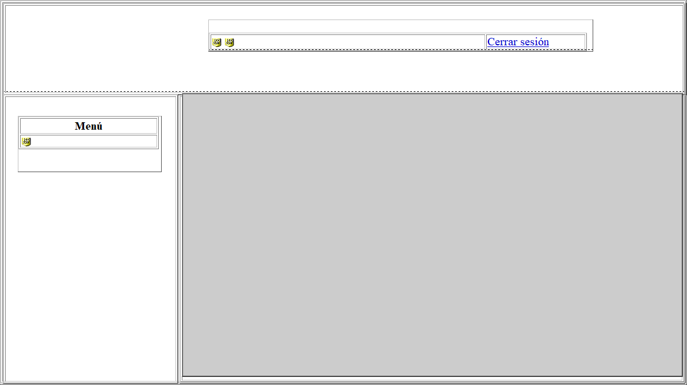
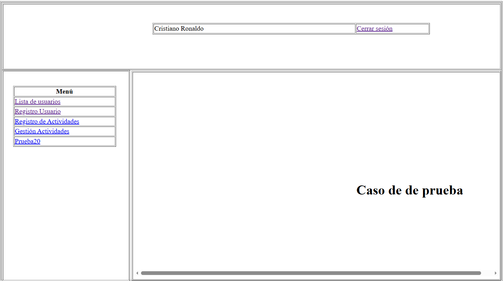

||
||
||

> **LAB.** **PRACTICA** **\#7** **CONTROL.** **DE** **ACCESO**
>
> **TEMAS** **DE** **APRENDIZAJE:** Administración de permisos de
> usuario.
>
> **ACTIVIDAD** **DE** **ENSEÑANZA** **–** **APRENDIZAJE** **–**
> **EVALUACIÓN:** Implementación de permisos de usuario y visualización
> dinámica de las actividades de navegación del usuario.
>
> **TIEMPO** **DE** **LA** **ACTIVIDAD** **DE** **E-A-E:** 2 horas
>
> **TIEMPO** **DEL** **TALLER** **DE** **APRENDIZAJE:** 2 horas
>
> **OBJETIVOS:**

Construir un prototipo funcional basado en la web que permita
administrar los perfiles de los usuarios en la aplicación, así como
gestionar y administrar sus actividades operativas, mediante procesos de
validación y manejo de sesiones del usuario final.

> **ORIENTACIONES:**
>
> • Este laboratorio es la continuación de la práctica \#7
>
> • La actividad se deberá realizar en clase en equipos máximo de dos
> estudiantes
>
> **Conceptos:**
>
> **DashBoard** **o** **Panel** **de** **Control** **(cpanel)** es un
> tablero controlado a través de una interfaz donde el usuario puede
> administrar el equipo, roles, actividades y/o software.
>
> **Menú** en informática, un menú es una serie de opciones que el
> usuario puede elegir para realizar determinadas tareas.
>
> **El** **menú** **dinámico** permite la gestión y administración de
> las diferentes opciones desplegadas a través del dashboard y a las que
> puede acceder un determinado usuario de acuerdo con el perfil.
>
> Ing.YamilBuenañoPalacios, PhD

||
||
||

>  style="width:6.34236in;height:3.56458in" />1. Después de crear el
> Dashboard, como se muestra en la Figura 1, proceda a configurarlo con
> el fin de definir y visualizar las distintas acciones o roles que se
> presentarán una vez sean asignados a los perfiles.
>
> Fig. 1
>
> Ing. YamilBuenañoPalacios, PhD

||
||
||

> 2\. Abra el **Dashboard** o **cpanel** en modo código y agregue los
> siguientes códigos:

\<%@page import="Modelo.Conexion"%\>

\<%@ page contentType="text/html; charset=utf-8" language="java"
import="java.sql.\*" errorPage="" %\> \<%@ page import=
"Modelo.Conexion" %\>

***//Recuperación*** ***de*** ***la*** ***sesión*** **\<%**

HttpSession **sesion_cli** = request.getSession(true);

String **nUsuario**=(String)sesion_cli.getAttribute("nUsuario");

Connection con=null; Statement sentencia=null; ResultSet resultado =
null; String nombre=null; String apellido=null;

**%\>**

\<!DOCTYPE html PUBLIC "-//W3C//DTD XHTML 1.0 Transitional//EN"
"http://www.w3.org/TR/xhtml1/DTD/xhtml1-transitional.dtd"\>

\<html xmlns="http://www.w3.org/1999/xhtml"\>

**\<head\>**

\<meta http-equiv="Content-Type" content="text/html; charset=utf-8" /\>
\<title\>Documento sin título\</title\>

\<style type="text/css"\> \#apDiv1 {

> position: absolute; left: 263px;
>
> top: 50px; width: 1192px; height: 669px; z-index: 1;

}

\#apDiv2 {

> position: absolute; left: 268px;
>
> top: 55px; width: 1186px; height: 153px; z-index: 2;

}

> Ing. YamilBuenañoPalacios, PhD

||
||
||

\#apDiv3 {

> position: absolute; left: 268px;
>
> top: 214px; width: 303px; height: 503px; z-index: 3;

}

\#apDiv4 {

> position: absolute; left: 575px;
>
> top: 217px; width: 877px; height: 500px; z-index: 4;

}

\#apDiv5 {

> position: absolute; left: 294px;
>
> top: 252px; width: 248px; height: 96px; z-index: 5;

}

\#apDiv6 {

> position: absolute; left: 625px;
>
> top: 84px; width: 667px; height: 51px; z-index: 6;

}

\#apDiv7 {

> position: absolute; left: 579px;
>
> top: 212px; width: 848px; height: 493px; z-index: 7;

}

> Ing. YamilBuenañoPalacios, PhD

||
||
||

\#apDiv8 {

> position: absolute; left: 355px;
>
> top: 495px; width: 146px; height: 92px; z-index: 8;

} \</style\> **\</head\>**

**\<body\>**

**//** ***Crea*** ***la*** ***conexión*** ***y*** ***genera*** ***la***
***consulta*** ***que*** ***permite*** ***extraer*** ***los***
***campos*** ***nombres*** ***y*** ***apellidos*** ***de*** ***la***
***base*** ***de*** ***datos*** ***que*** ***serán*** ***visualizados***
***en*** ***el*** ***Dashboard*** ***y*** ***que*** ***identifican***
***al*** ***usuario*** ***que*** ***está*** ***en*** ***sesión*.**

> **\<%** try {
>
> Conexion cn = new Conexion(); con = cn.crearConexion();
>
> sentencia=con.createStatement();
>
> resultado=sentencia.executeQuery("SELECT \* from datos WHERE usuario
> ='"+**nUsuario**+"' ");
>
> while(resultado.next()) {
>
> nombre=resultado.getString("nombre");
> apellido=resultado.getString("apellido");
>
> }
>
> }
>
> catch(Exception e){} con.close();
>
> **%\>**
>
> Ing. YamilBuenañoPalacios, PhD

||
||
||

***//*** ***Consulta*** ***que*** ***permite*** ***seleccionar***
***la*** ***información*** ***de*** ***las*** ***actividades***
***asignadas*** **\<%**

> if(usu.equals(**nUsuario**)){
>
> Conexion cn1 = new Conexion(); con = cn1.crearConexion();
> sentencia=con.createStatement();

resultado=sentencia.executeQuery("SELECT actividades.nom_actividad AS
actividad, actividades.id_actividad AS idAct, actividades.enlace AS
enlace FROM datos, actividades, gestactividad, perfiles WHERE
gestactividad.id_actividad = actividades.id_actividad AND
gestactividad.id_perfil = perfiles.id_perfil AND Datos.id_perfil =
perfiles.id_perfil AND datos.usuario ='"+nUsuario+"' ");

**%\>**

\

> \<table width="1191" height="667" border="1"\> \<tr\>
>
> \<td\>&nbsp;\</td\> \</tr\>

\</table\> \</div\>

\

> \<table width="1184" height="159" border="1"\> \<tr\>
>
> \<td\>&nbsp;\</td\> \</tr\>

\</table\> \</div\>

\

> \<table width="303" height="503" border="1"\> \<tr\>
>
> \<td\>&nbsp;\</td\> \</tr\>

\</table\> \</div\>

\

> \<table width="876" height="498" border="1"\> \<tr\>
>
> \<td\>&nbsp;\</td\> \</tr\>

**\</table\>** \</div\>

> Ing. YamilBuenañoPalacios, PhD

||
||
||

\

> \<table width="244" border="1"\> \<tr\>
>
> \<th\>\<strong\>Menú\</strong\>\</th\> \</tr\>
>
> ***//Visualiza*** ***en*** ***el*** ***menú*** ***de*** ***opciones***
> ***las*** ***actividades*** ***asignadas*** ***al*** ***perfil***
> ***de*** ***usuario*** **\<%**
>
> while(resultado.next())**{** **%\>**
>
> \<tr\>
>
> \<td\>\<a
> href="**\<%**=resultado.getString("enlace")**%\>**?id=\<%=resultado.getInt("idAct")%\>"
> target="**marco**"\> \<%=resultado.getString("actividad")
>
> **%\>**\</a\>\</td\> \</tr\>
>
> \<%**}**%\>
>
> \<%}%\> **\</table\>**

\</div\>

\
&nbsp;

***//Visualiza*** ***en*** ***el*** ***Dashboard*** ***los***
***nombres*** ***y*** ***apellidos*** ***del*** ***usuario*** ***en***
***sesión*** \<table width="657" border="1"\>

> \<tr\>
>
> \<td width="473"\>\<%=nombre%\>&nbsp;\<%=apellido%\>\</td\> \<td
> width="168"\>\<a href="cerrarSesion"\>Cerrar sesión\</a\>\</td\>
>
> \</tr\> \</table\>

\</div\>

***//Espacio*** ***de*** ***navegación*** ***donde*** ***se***
***visualizará*** ***las*** ***operaciones*** ***transaccionales***
***de*** ***la*** ***aplicación*** \

**\<iframe** width="869" height="493" name="**marco**"
src="**front.jsp**" frameborder="0"\>**\</iframe\>** \</div\>

**\</body\>**

**\</html\>**

> Ing. YamilBuenañoPalacios, PhD

||
||
||

> 3\. Cree un nuevo archivo con el nombre “**front.jsp”**, el cual será
> invocado en el dashboard. Como se muestra en el siguiente fragmento de
> código.
>
> \<%@ page contentType="text/html; charset=utf-8" language="java"
> import="java.sql.\*" errorPage="" %\>
>
> \<!DOCTYPE html PUBLIC "-//W3C//DTD XHTML 1.0 Transitional//EN"
> "http://www.w3.org/TR/xhtml1/DTD/xhtml1-transitional.dtd"\>
>
> \<html xmlns="http://www.w3.org/1999/xhtml"\> \<head\>
>
> \<meta http-equiv="Content-Type" content="text/html; charset=utf-8"
> /\> \<title\>Documento sin título\</title\>
>
> \<style type="text/css"\>
>
> \#apDiv1 {
>
> position: absolute; left: 529px;
>
> top: 247px; width: 367px; height: 91px; z-index: 1;
>
> } \</style\> \</head\>
>
> \<body\>
>
> \
 \<h1\>Caso de prueba\</h1\>
>
> \</div\> \</body\> \</html\>
>
> Ing. YamilBuenañoPalacios, PhD

||
||
||

>  style="width:6.84514in;height:3.83333in" />4. Al concluir la
> configuración, se deberá visualizar una pantalla como se muestra en la
> figura 2.
>
> Fig. 2
>
> Ing. YamilBuenañoPalacios, PhD
