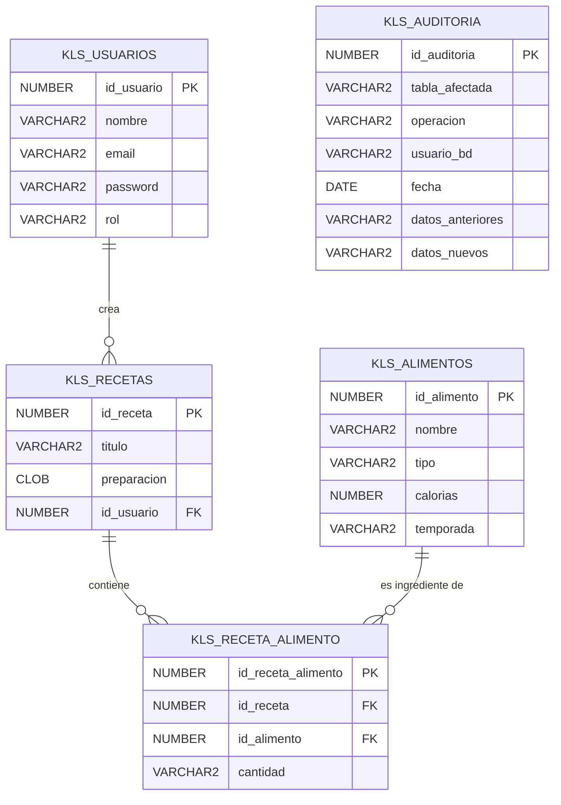

# Fase 1: Diseño de la Base de Datos

**Importante:** En todos los nombres de base de datos o tablas se usó el prefijo `KLS_` (iniciales de los apellidos).

## 1. Diagrama Relacional

A continuación se presenta el diagrama Entidad-Relación utilizando el formato Mermaid (puedes visualizarlo copiando el código en [Mermaid Live Editor](https://mermaid.live)):

---

## 2. Diccionario de Datos

### Tabla: `KLS_USUARIOS`
Almacena la información de los usuarios registrados.
| Campo | Tipo de Dato | Longitud | Restricciones | Descripción |
|---|---|---|---|---|
| id_usuario | NUMBER | - | PK, AUTO_INCREMENT | Identificador único del usuario |
| nombre | VARCHAR2 | 100 | NOT NULL | Nombre completo o alias del usuario |
| email | VARCHAR2 | 150 | UNIQUE, NOT NULL | Correo electrónico para acceso |
| password | VARCHAR2 | 255 | NOT NULL | Contraseña (hasheada en producción) |
| rol | VARCHAR2 | 20 | DEFAULT 'usuario' | Rol en el sistema (admin/usuario) |

### Tabla: `KLS_ALIMENTOS`
Almacena la información de las frutas y verduras.
| Campo | Tipo de Dato | Longitud | Restricciones | Descripción |
|---|---|---|---|---|
| id_alimento | NUMBER | - | PK, AUTO_INCREMENT | Identificador único del alimento |
| nombre | VARCHAR2 | 100 | NOT NULL | Nombre de la fruta o verdura |
| tipo | VARCHAR2 | 20 | NOT NULL | Indica si es 'Fruta' o 'Verdura' |
| calorias | NUMBER | - | - | Calorías estimadas por 100g |
| temporada | VARCHAR2 | 50 | - | Época del año en la que se cosecha |

### Tabla: `KLS_RECETAS`
Almacena las recetas y su creador.
| Campo | Tipo de Dato | Longitud | Restricciones | Descripción |
|---|---|---|---|---|
| id_receta | NUMBER | - | PK, AUTO_INCREMENT | Identificador de la receta |
| titulo | VARCHAR2 | 200 | NOT NULL | Título de la receta |
| preparacion | CLOB | - | NOT NULL | Instrucciones de preparación |
| id_usuario | NUMBER | - | FK | Usuario que creó o registró la receta |

### Tabla: `KLS_RECETA_ALIMENTO`
Tabla intermedia que relaciona las Recetas con los Alimentos (Ingredientes).
| Campo | Tipo de Dato | Longitud | Restricciones | Descripción |
|---|---|---|---|---|
| id_receta_alimento | NUMBER | - | PK, AUTO_INCREMENT | Identificador único de la relación |
| id_receta | NUMBER | - | FK, NOT NULL | ID de la receta relacionada |
| id_alimento | NUMBER | - | FK, NOT NULL | ID del alimento (ingrediente) relacionado |
| cantidad | VARCHAR2 | 50 | - | Cantidad requerida del ingrediente (ej. '2 tazas') |

### Tabla: `KLS_AUDITORIA`
Almacena todo el historial de cambios de la base de datos (CRUD).
| Campo | Tipo de Dato | Longitud | Restricciones | Descripción |
|---|---|---|---|---|
| id_auditoria | NUMBER | - | PK, AUTO_INCREMENT | Identificador único del registro |
| tabla_afectada | VARCHAR2 | 50 | NOT NULL | Nombre de la tabla que sufrió cambios |
| operacion | VARCHAR2 | 10 | NOT NULL | INSERT, UPDATE o DELETE |
| usuario_bd | VARCHAR2 | 50 | NOT NULL | Usuario de base de datos que hizo el cambio |
| fecha | TIMESTAMP | - | DEFAULT SYSTIMESTAMP | Fecha y hora exacta del cambio |
| datos_anteriores | VARCHAR2 | 4000 | - | Valores que tenía el registro antes del cambio |
| datos_nuevos | VARCHAR2 | 4000 | - | Nuevos valores insertados o actualizados |